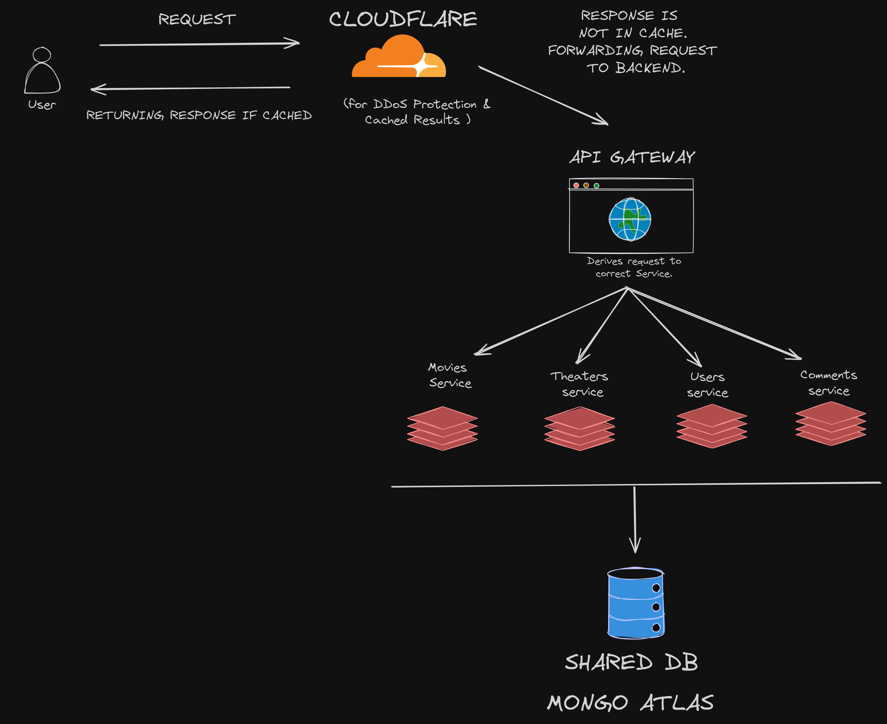

# Node.js Microservices CRUD Application

## Overview

This project is a microservices-based CRUD (Create, Read, Update, Delete) application, developed using Node.js. It's designed following the microservices architecture as depicted in the included diagram. The system is composed of distinct services that communicate with a shared database, each responsible for different business functionalities.

## Architecture

The application consists of the following microservices:

- **Movies Service**: Handles all CRUD operations related to movie data.
- **Theaters Service**: Manages information and CRUD operations for theaters.
- **Users Service**: Responsible for user data and CRUD operations.
- **Comments Service**: Manages comments and their related CRUD operations.

All these services interact with a centralized **Shared Database**, ensuring data consistency and integrity across the application.



## Getting Started

### Prerequisites

- Node.js (version X or above)
- MongoDB (version Y or above) or any other chosen database
- Any other dependencies...

### Installation

1. Clone the repository

```bash
git clone https://github.com/your-username/.git
```

2. Install dependencies for each service
   cd service-name
   npm install

3. Repeat for each microservice...

### Running the Services

To run each service, execute the following command inside the service directory:
npm start

## API Endpoints

Each service exposes various endpoints for CRUD operations. Below are examples for the Movies Service:

- `GET /movies`: Retrieve all movies.
- `POST /movies`: Create a new movie.
- `GET /movies/{id}`: Retrieve a movie by ID.
- `PUT /movies/{id}`: Update a movie by ID.
- `DELETE /movies/{id}`: Delete a movie by ID.

Document similar endpoints for the other services.

## Testing

Explain how to run the automated tests for this system

- **Unit Testing**: For unit testing, navigate to the service directory and run:
  npm test

Include instructions on what the tests cover and any relevant information about testing frameworks and standards used (e.g., Jest, Mocha).

## Contributing

We encourage public contributions! Please follow these steps to contribute:

1. Fork the repository.
2. Create a new branch (`git checkout -b feature-branch`).
3. Make changes and add them (`git add .`).
4. Commit your changes (`git commit -m 'Add some feature'`).
5. Push to the branch (`git push origin feature-branch`).
6. Create a new Pull Request.

## License

This project is licensed under the MIT License

## Contact

- Martin Coll – [@martincoll](https://www.linkedin.com/in/martincoll/)
- Email – contacto@martincoll.dev

## Acknowledgements

-
